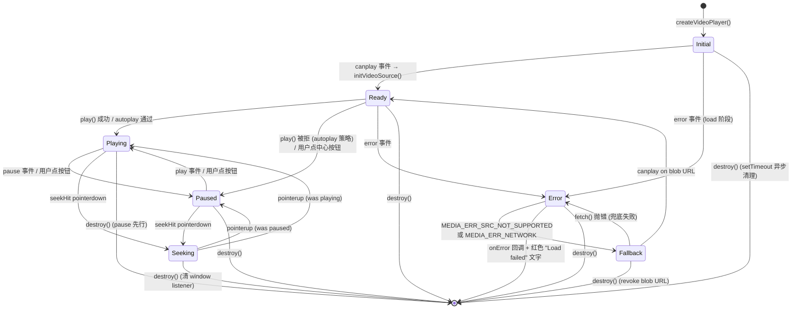

# PixiVideoPlayer — `createVideoPlayer`

手动 `<video>` 元素 + PIXI v8 `VideoSource` 视频播放器。带 play/pause 控件、进度条、seek、时间显示、CORS fetch blob fallback。首帧 primer 处理 autoplay=false 时的黑屏。

---

## 什么时候**不要**用这个组件

**PIXI 的 `VideoSource` 本质就是 `<video>` 元素 + 一层 Texture 包装。** 浏览器已经把 `<video>` 硬件加速到极致，PIXI 每帧通过 rVFC / ticker 把帧上传到 GPU 纹理**纯亏不赚**——除非你确实需要把视频帧作为 PIXI scene graph 的一部分消费。

**90% 的"我要在网页上放个能播的视频"场景都应该用 [`VideoPlayer`](./VideoPlayer.md) 而不是这个。** 那个就是 `<video controls>` 的薄包装，零 PIXI 依赖、零 bug surface、零生命周期陷阱。

**这个组件存在的理由**（按强度排序）：

1. **要把视频帧喂给 PIXI Filter**（BlurFilter / ColorMatrixFilter / DisplacementFilter 等后处理）
2. **要把视频跟其他 PIXI 内容合成**（粒子、Graphics、Custom Shader 都要采样视频帧）
3. **需要 SubCanvas 统一事件系统命中视频区域**（PIXI 内的 hover / pointerdown 路由）
4. **要在同一棵 scene tree 里做 z-order、mask、嵌套 transform**

如果以上四点你都不需要，**用 `<VideoPlayer>`**。

**典型应该用 `<VideoPlayer>` 而非本组件的场景**：
- 后台管理系统嵌入教学视频
- 营销页 hero 区放产品演示
- 任何"播放、暂停、seek、看完"的纯展示场景
- 需要响应式布局、跨设备兼容、浏览器原生全屏的场合

**本组件的代价**（踩过的坑，按严重度）：
- `texture.destroy(true)` cascade 到 `VideoSource.destroy()` 内部 `source.src = ""; source.load()` Abort → Chromium 媒体 Cache Lock 死锁（注意事项 #17）
- PIXI renderer 下一帧读已 null 化的 `_sourceRect.x` → `Cannot read properties of null`（注意事项 #16）
- 首帧 primer 与用户主动播放的竞态需要 `userPlayRequested` 标志守护（注意事项 #12）
- React Strict Mode 合成 cleanup 触发 Abort → 同 URL 二次挂载死锁（注意事项 #17）
- `videoTexture` GPU 内存 + `<video>` 元素双资源生命周期管理（注意事项 #4、#11）
- CORS / Range 失败要手写 fetch → blob URL 兜底（注意事项 #6）

**对比**（同一个视频播放功能）：

| 维度 | `createVideoPlayer` (本组件) | `<VideoPlayer>` (DOM) |
|------|------------------------------|----------------------|
| 代码量 | ~440 行 + .md | ~40 行 + .md |
| 控件 UI | 自定义 PIXI 控件（cpb / ctrl / playBtn / seekHit） | 浏览器原生 `<video controls>` |
| Filter / Shader 支持 | ✅ 直接套 | ❌ 不支持 |
| 跨设备兼容 | 仅支持 PIXI 支持的平台 | 所有浏览器、所有设备 |
| React Strict Mode | 需要特殊处理（deferred cleanup） | 不需要（浏览器自己管） |
| 全屏 API | 要手写 | 浏览器原生 |
| 字幕 / 章节 / 画中画 | 要手写 | 浏览器原生 |
| 已知 critical bug 数 | 4+ | 0 |

---

## 调用栈

---

## 调用栈

### 创建
```
createVideoPlayer(parent, opts)
  ├─ new PIXI.Container()                  // root
  ├─ root.x/y = opts.x/y
  ├─ parent.stage.addChild(root)
  ├─ mask (Graphics, fill)  — 裁剪 root
  ├─ root.mask = mask
  ├─ hoverHit (Container, eventMode='static')  — 整个视频区域的 hover 命中
  ├─ bg (Graphics)           — 暗色背景
  ├─ videoSprite (Sprite)     — VideoSource 纹理挂载点
  ├─ cpb (Container)         — 中心播放按钮 (autoplay=false 时显示)
  ├─ ctrl (Container)        — 底部控制条
  │    ├─ ctrlBg (Graphics)
  │    ├─ playBtn (Container) — play/pause 切换
  │    ├─ timeText (Text)     — "--:-- / --:--"
  │    ├─ progBg (Graphics)   — 进度条背景
  │    ├─ progFill (Graphics) — 进度条填充
  │    └─ seekHit (Container) — 进度条点击命中
  ├─ htmlVideo = document.createElement('video')
  │    ├─ crossOrigin='anonymous', playsInline=true, muted, loop
  │    └─ style: position:absolute, left:-9999px, width/height=opts.width/height
  ├─ document.body.appendChild(htmlVideo)   — 必须在 DOM 才能解帧
  ├─ readyState 检查或 addEventListener('canplay', initVideoSource, { once: true })
  └─ htmlVideo.src = url; htmlVideo.load()
```

### 首帧 primer (initVideoSource 内)
```
initVideoSource()  — canplay 触发时调用
  ├─ videoSource = new PIXI.VideoSource({ resource: htmlVideo, autoPlay, updateFPS: 0 })
  ├─ videoTexture = new PIXI.Texture({ source: videoSource })
  ├─ videoSprite.texture = videoTexture
  ├─ adjustSpriteScale()  — 用 videoWidth/videoHeight 设 scale
  └─ if (!autoplay):
       临时 muted = true → play() → pause() → currentTime = 0 → 恢复 muted
       (绕 autoplay policy 捕获首帧入纹理)
```

### seek 拖动 (双层监听)
```
seekHit.on('pointerdown', onSeekDown)
  ├─ onSeekDown(e) — PIXI 命中
  │    ├─ seeking = true
  │    ├─ htmlVideo.currentTime = pct * duration
  │    └─ window.addEventListener('pointermove', onWinMove)
  │              window.addEventListener('pointerup', onWinUp)
  ├─ onWinMove(e) — DOM move, 跨边界时 PIXI 收不到
  │    ├─ 计算 canvas-relative X (clientX - rect.left)
  │    └─ htmlVideo.currentTime = pct * duration
  └─ onWinUp() — 清理 window listener
```

### CORS 错误 fallback (onVideoError)
```
htmlVideo.addEventListener('error', onVideoError)
  ├─ code = htmlVideo.error?.code
  ├─ if (code === SRC_NOT_SUPPORTED || NETWORK):
  │    └─ fetch(url) → URL.createObjectURL(blob) → htmlVideo.src = objectUrl
  └─ if (fallback 失败): 触发 onError + 显示 "Load failed" 文字
```

### 销毁
```
handle.destroy()
  ├─ htmlVideo.pause()                              — 先暂停，不再抛事件
  ├─ removeEventListener 自家监听 (canplay/loadedmetadata/timeupdate/seeked/play/pause/error)
  ├─ videoTexture?.destroy(true)                    — 原子销毁 texture+source
  ├─ videoSource = null; videoTexture = null
  ├─ htmlVideo.removeAttribute('src'); htmlVideo.load()   — 截断后台下载
  ├─ htmlVideo.parentNode.removeChild(htmlVideo)    — DOM 移除
  ├─ URL.revokeObjectURL(objectUrl)
  ├─ clearTimeout(hideTimer) + window.removeEventListener (seek)
  └─ root.parent.removeChild(root) + root.destroy({ children: true })
```

---

## API

### `createVideoPlayer`

```ts
function createVideoPlayer(parent: SubCanvas, opts: PixiVideoPlayerOptions): PixiVideoPlayerHandle
```

| 参数 | 类型 | 说明 |
|------|------|------|
| `parent` | `SubCanvas` | 父级子画布，root 添加到 parent.stage |
| `opts` | `PixiVideoPlayerOptions` | 见下方 |

### PixiVideoPlayerOptions

```ts
interface PixiVideoPlayerOptions {
  url: string;                     // 视频 URL
  x?: number;                      // 容器在 parent 中的 X (默认 0)
  y?: number;                      // 容器在 parent 中的 Y (默认 0)
  width: number;                   // 播放器宽度
  height: number;                  // 播放器高度
  loop?: boolean;                  // 循环播放 (默认 false)
  muted?: boolean;                 // 静音 (默认 true)
  autoplay?: boolean;              // 自动播放 (默认 false)
  showControls?: boolean;          // 显示控制条 (默认 true)
  onLoad?: () => void;             // loadedmetadata 触发
  onError?: (e: Error) => void;    // 视频错误触发 (fallback 失败后)
  onDebug?: (msg: string) => void; // 调试日志回调
}
```

### PixiVideoPlayerHandle

```ts
interface PixiVideoPlayerHandle {
  play(): void;
  pause(): void;
  toggle(): void;                          // 切换 play/pause
  seek(t: number): void;                   // 跳转到 t 秒
  setControlsVisible(v: boolean): void;    // 显示/隐藏控制条
  destroy(): void;
  readonly destroyed: boolean;
  readonly paused: boolean;
  readonly duration: number;
  readonly currentTime: number;
}
```

---

## 使用

### 基本用法

```ts
const player = createVideoPlayer(sc, {
  url: 'https://example.com/video.mp4',
  x: 40, y: 40,
  width: 640, height: 360,
  autoplay: false,
  loop: true,
  muted: false,
});
```

### 外部控制

```ts
player.toggle();           // 切换 play/pause
player.seek(0);            // 跳到开头
player.setControlsVisible(false);  // 隐藏控制条
```

### 调试日志

```ts
const player = createVideoPlayer(sc, {
  url: '...',
  width: 640, height: 360,
  onDebug: (msg) => console.log('[video]', msg),
});
```

---

## 应用范围

适合：
- **内嵌视频播放**（产品演示 / 教学视频 / 背景视频）
- **需要自定义 PIXI 控件 UI**（不能接受 `<video controls>` 默认样式）
- **CORS 配置不稳定的外部 CDN**（fetch blob fallback 兜底）

不适合：
- **流式 / 直播**（HLS / DASH — 需要 hls.js / dash.js，PIXI VideoSource 不支持）
- **音频播放**（用 `HTMLAudioElement` + PIXI.AudioSource，或纯 Web Audio API）
- **多视频同步**（每个 player 独立解码，无法帧同步）

---

## 注意事项

1. **视频元素必须挂到 DOM**：Chrome/Safari 不在 DOM 中的 video 不解帧。`document.body.appendChild(htmlVideo)` 必须调。
2. **off-screen 元素尺寸要合理**：`width: 1px; opacity: 0` 风格的隐藏 video 会被 Chrome 降帧解码 → 画面卡。`left: -9999px` + 实际播放器尺寸是正确做法。
3. **`updateFPS: 0` = 每 tick 同步**：固定间隔（如 30）在 60Hz 屏上会抖动，0 跟渲染同频最平滑。
4. **destroy 顺序固定**：`pause()` → 摘自家 listener → **`videoTexture.destroy(true)`** 原子销毁（cascade 到 source）→ `removeAttribute('src') + load()` → DOM removeChild → `revokeObjectURL` → `root.destroy()`。关键：必须用 `videoTexture.destroy(true)` 在同一原子操作里销毁 source，不能先 `videoSource.destroy()` 再 `videoTexture.destroy()` —— 中间存在窗口，texture 仍引用已销毁的 source，PIXI renderer 下一帧调 `source.update()` 读 `_sourceRect.x`（destroy 时被 null 化）→ `Cannot read properties of null (reading 'x')` at `HTMLVideoElement.Ce`。
5. **autoplay=false 需要首帧 primer**：VideoSource 纹理在 video pause 时不更新帧 → 黑屏。primer 临时 mute → play() → pause() → currentTime=0 捕获首帧。
6. **CORS + Range 失败的 fallback**：`MEDIA_ERR_SRC_NOT_SUPPORTED` / `MEDIA_ERR_NETWORK` 时 fetch URL → blob → `URL.createObjectURL` 替换 src。这是 `PIXI.Assets.load()` 做不到的（错误粒度太粗，`MediaError.code` 不可读）。
7. **seek 双层监听**：PIXI 命中区在时走 PIXI，跨边界（快拖）走 `window.addEventListener('pointermove')`。位置直接读 `e.clientX`（canvas `position: fixed; inset: 0`，`client == canvas-relative == PIXI coord`）。
8. **destroyed 守卫**：所有 `dbg`/`adjustSpriteScale`/async primer 回调都先 `if (destroyed) return`，否则在 destroy 期间触达已销毁的 PIXI 对象会 crash。
9. **HUD 必须在 PIXI 层**：在 PIXI canvas 上盖 React DOM 元素会破坏 SubCanvas AABB 事件路由。HUD 也做成 SubCanvas + Scrollable + PIXI.Text。
10. **mask 必须 .fill()**：`new PIXI.Graphics().rect(0, 0, w, h).fill({ color: 0xffffff })`。空 path 的 Graphics 作为 mask 隐藏所有内容。
11. **canplay 监听在 destroy 时不能漏**（critical）：destroy 时若 `videoSource` 还是 null（canplay 未触发就被 destroy），`videoSource?.destroy()` 不执行 src="" 清理，且 canplay listener 还在。`<video>` 离 DOM 后继续后台拉流，下载完成触发 canplay → 调 `initVideoSource` → 在已销毁组件上重新创建 VideoSource/Texture，幽灵内存泄漏。**修法**：(1) `initVideoSource` 首行 `if (destroyed || videoReady) return;`；(2) `destroy()` 显式 `removeEventListener('canplay', initVideoSource)`；(3) `videoSource?.destroy()` 之后兜底 `htmlVideo.removeAttribute('src'); htmlVideo.load();` 截断下载。
12. **Prime 竞态与 `userPlayRequested` 标志**：Prime `play().then(pause + seek 0)` 是微任务。用户手速快在 Prime 启动后立刻点真实播放 → Prime.then 强制 pause+seek(0) → 视频播了零点几秒硬卡回 0。**修法**：`userPlayRequested` 标志，`doPlayAction` / `handle.play` / `handle.toggle` 主动播放时设 true；Prime.then 开头 `if (userPlayRequested) return;` 跳过强制 pause。
13. **VIDEO SETUP 顺序**：`addEventListener('canplay')` 必须**先于** `set src / load()`（防同步 canplay 漏事件）→ 然后 `readyState` 检查在 src 之后才有意义（针对浏览器缓存命中、canplay 不会触发的极端情况）。原代码顺序写反，`readyState` 永远 0。
14. **Fetch fallback MIME 动态继承**：原硬编码 `video/mp4` 把 WebM/MOV 也封成 mp4，Chromium 头部解析失败再抛 SRC_NOT_SUPPORTED。**修法**：`resp.headers.get('content-type') || 'video/mp4'`。
15. **Autoplay 策略阻截的 UI 假死**：`autoplay=true` + `muted=false` 浏览器必拦截 `play()` reject；但视频没播 → `pause` 事件不触发 → UI 永远显示"正在播放"假象。**修法**：(1) UI 初始化一律 `drawPlayIcon(false); cpb.visible = true;` 强制暂停态；(2) `VideoSource.autoPlay: false`，自己控；(3) `if (autoplay) htmlVideo.play().catch(dbg)` 自己调，失败时 UI 保持暂停态等待用户点击。
16. **destroy 中 texture/source 必须原子销毁**（critical）：原顺序 `videoSource?.destroy()` → ... → `videoTexture?.destroy(true)` 留下窗口：source 已被 PIXI 置 null（`_resourceBounds`/`_sourceRect` 等内部状态被 null 化），但 texture 仍引用它。PIXI renderer 下一帧调 `texture.source.update()`（minified 名 `Ce`）→ 读 `this._sourceRect.x` 或类似 → `TypeError: Cannot read properties of null (reading 'x') at HTMLVideoElement.Ce`。症状：导航离开播放中的视频时崩溃。**修法**：(1) 用 `videoTexture.destroy(true)` 一次性销毁 texture 和 source（PIXI v8 cascade 行为，destroy(true) 调 source.destroy()）；(2) 销毁后立即 `videoSource = null; videoTexture = null;` 阻止旧引用；(3) `destroy()` 首行 `htmlVideo.pause()` 阻止 video 继续抛事件。
17. **React Strict Mode 二次挂载触发 Chromium 媒体 Cache Lock 死锁**（critical，dev 模式重复进入视频不显示）：Strict Mode 的 `Mount → Unmount → Mount` 同步序列中，cleanup 调 `player.destroy()` → 内部 `htmlVideo.removeAttribute('src') + load()`（**以及** `videoTexture.destroy(true)` cascade 到 PIXI `VideoSource.destroy()` 内部的 `source.src = "" + source.load()`）→ 同步向浏览器网络栈发 Abort 信号截断第一道媒体流。几乎同时，Mount 2 发起对**同一 URL** 的新请求。Chromium 网络缓存因上次 Abort 产生竞态闭塞，第二道请求永远 Pending，`readyState=0`，`canplay` 一辈子不触发，`initVideoSource` 不跑，`videoTexture` 没建，画面死寂。**修法**（v3，defer Abort 也不够 → 完全不 Abort）：`destroy()` 同步部分保留 pause、removeEventListener、scene graph 摘除；`setTimeout(0)` 异步部分只做三件事——手动 `cancelVideoFrameCallback` 断 rVFC 循环、`parentNode.removeChild(oldVideo)` 摘 DOM、`URL.revokeObjectURL`。texture 用 `destroy(false)` 销毁（**不** cascade → 不调 `VideoSource.destroy()` → 不发 Abort）。old htmlVideo 脱离 DOM 后被 GC，浏览器自动取消网络请求，无 Abort 信号 → 无 Cache Lock。source 变 orphan，listener 闭包随 htmlVideo 一起 GC，无泄漏。**关键**：PIXI v8 `VideoSource.destroy()` 内部 `source.src = ""; source.load()` 是 Abort 源头，**必须**用 `destroy(false)` 跳过 cascade。

---

## 状态图



**状态变量**（闭包内 `let`）：
- `destroyed` — 一旦 `destroy()` 调过，所有 listener/回调首行守卫返回
- `videoReady` — `initVideoSource` 跑过标志，防 canplay 二次触发
- `paused` — 当前播放状态，对外 `handle.paused` 只读
- `seeking` — 用户正在拖动进度条
- `userPlayRequested` — 用户主动播过标志，Prime 竞态守护

**关键不变量**：
- `Initial` 期间 `videoSource === null && videoTexture === null`（canplay 未到）
- `Ready` 之后 `videoSource` 和 `videoTexture` 永不为 null（直到 destroy）
- `destroyed === true` 之后所有 async 回调（canplay / loadedmetadata / timeupdate / seeked / play / pause / error / primer.then）首行 `if (destroyed) return`
- `Initial` 状态下 `destroy()` 必须显式 `removeEventListener('canplay', initVideoSource)`，否则幽灵 canplay 在组件销毁后重建 VideoSource/Texture（见注意事项 #11）
