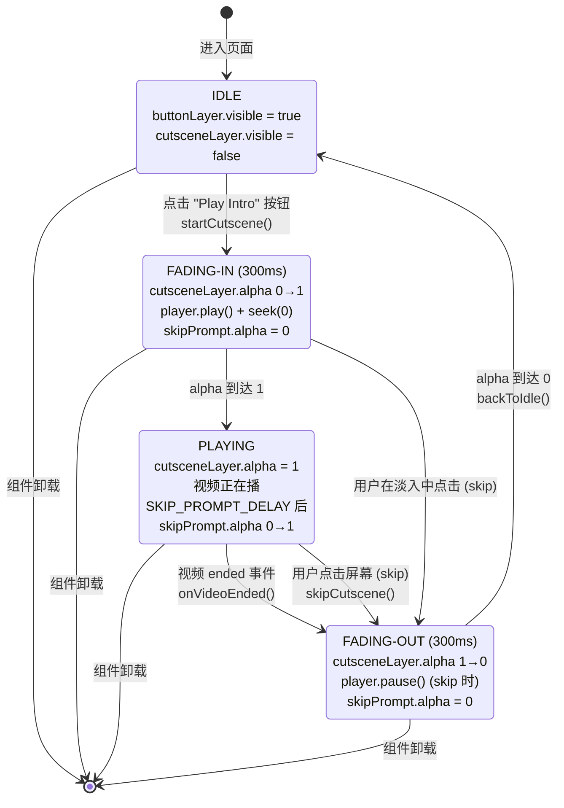

# ComponentCutsceneDisplay — 过场动画示例

`src/example/component-cutscene/ComponentCutsceneDisplay.tsx` 的对应文档。

---

## 职责

演示 `createVideoPlayer` 的"完全无 UI"过场动画用法：
- 全屏黑底 + 16:9 视频居中（fit-contain，黑边由背景填充）
- 视频 300ms 淡入 / 300ms 淡出
- 视频自动播放（用户点击按钮触发，绕过 autoplay 策略）
- "Click anywhere to skip" 提示在播放稳定后淡入
- 视频自然结束 → 淡出 → 回到按钮
- 用户主动点击 → 立即淡出 → 回到按钮

适用场景：游戏开场动画、关卡过场、片头 logo 动画、剧情视频等"播一次就消失"的内容。

---

## 状态图



---

## 实现要点

### 1. 视频 16:9 fit-contain 居中

```ts
let vw = W;
let vh = (W * 9) / 16;
if (vh > H) { vh = H; vw = (H * 16) / 9; }
const vx = (W - vw) / 2;
const vy = (H - vh) / 2;
```

视口任何宽高比都让视频完整可见，剩余区域由黑底覆盖。

### 2. `createVideoPlayer` 关键选项

```ts
player = createVideoPlayer(root, {
  url: STABLE_MP4_URL,
  x: vx, y: vy, width: vw, height: vh,
  loop: false,            // 不循环, 播完触发 onEnded
  muted: false,           // 过场通常需要声音
  autoplay: false,        // 不自动, 按钮触发 (绕过 autoplay 策略)
  showControls: false,    // 不显示底部控件
  hidePlayButton: true,   // 不显示中心播放按钮 (新选项)
  onEnded: onVideoEnded,  // 视频自然结束回调
});
```

**`hidePlayButton` 是为这个场景新加的选项**：在暂停/淡出瞬间，中心播放按钮（cpb）会闪一下。设 true 后 cpb 永远不显示，干净过场。

### 3. 状态机驱动

所有时间相关的逻辑都走 `Ticker` 回调（通过 `root.ticker.add(fn)`），不用 setTimeout：

```ts
tickerFn = () => {
  if (state === 'fading-in' || state === 'fading-out') {
    const elapsed = performance.now() - fadeStart;
    const t = Math.min(1, elapsed / FADE_DURATION);
    if (state === 'fading-in') {
      cutsceneLayer.alpha = t;
      if (t >= 1) state = 'playing';
    } else {
      cutsceneLayer.alpha = 1 - t;
      if (t >= 1) backToIdle();
    }
  }
  if (state === 'playing' && skipPrompt.alpha < 1) {
    skipPrompt.alpha = Math.min(1, skipPrompt.alpha + 0.04);
  }
};
```

**为什么用 Ticker 而不是 setTimeout**：Ticker 跟 PIXI 渲染同步，每帧调用一次，淡入淡出与视频播放帧同步。setTimeout 会被主线程阻塞（GC / 长任务）导致跳帧。

### 4. 跳过逻辑

`skipLayer` 是全屏透明命中区（cutsceneLayer 的第一个子节点，zIndex 最低），专门用来捕获点击事件。点击后 `skipCutscene()` 进入 fading-out，pause 视频，停掉音频。

### 5. 不变量

- `cutsceneLayer.alpha` 始终是 0~1，由 ticker 驱动
- `buttonLayer.visible` 和 `cutsceneLayer.visible` 互斥（一个为 true 时另一个为 false）
- `state` 转换只发生在 ticker 回调和事件回调中，没有其他地方改写
- 组件卸载时 `tickerObj.remove(tickerFn)` + `player.destroy()` + `destroyApp()`，无泄漏

---

## PixiVideoPlayer 新增的选项

为这个 example 新增了 `PixiVideoPlayerOptions` 的两个字段：

| 字段 | 类型 | 默认 | 说明 |
|------|------|------|------|
| `hidePlayButton` | `boolean` | `false` | 隐藏中心播放按钮 (cpb)，暂停/淡出时也不显示 |
| `onEnded` | `() => void` | — | 视频自然结束回调（`loop=false` 时 `ended` 事件触发） |

`onEnded` 也适用于"播完一段做点别的事"的其他场景，不限于过场动画。

---

## 调试方法

- **按钮没反应**：看 console 有没有 `[PixiVideoPlayer]` 开头的 dbg 日志，确认 `canplay` 触发了
- **视频不显示**：HUD 没有就是网络问题；DevTools Network 看 friday.mp4 请求状态
- **淡入淡出卡顿**：把 `FADE_DURATION` 改大（500-800ms）观察；卡顿通常是 GC 引起
- **skip 没反应**：确认 `skipLayer` 在 cutsceneLayer 的 zIndex 最低，能盖到全屏
- **视频播完按钮不回来**：检查 `onEnded` 是否接到，看 `state` 是不是从 `playing` 转到 `fading-out`
