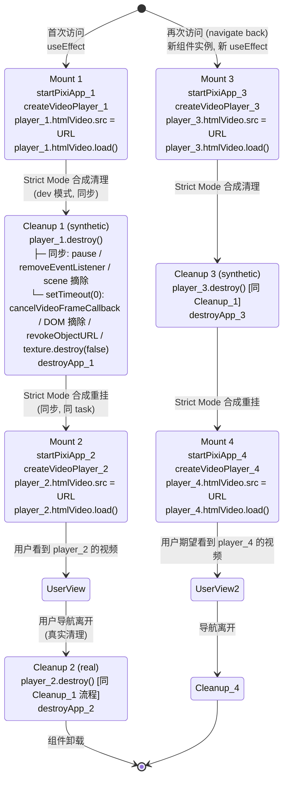
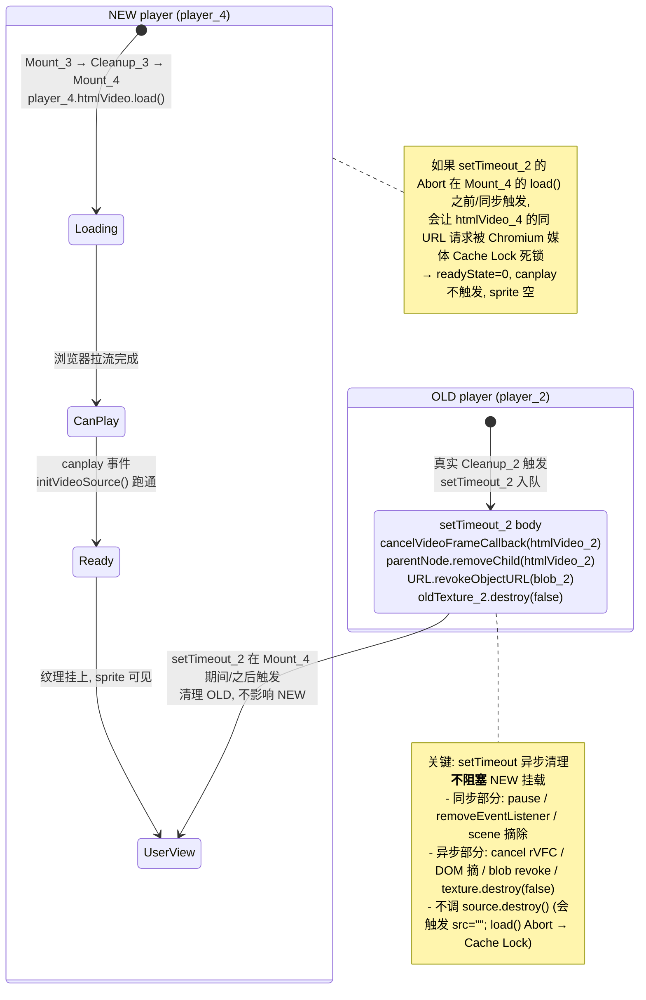
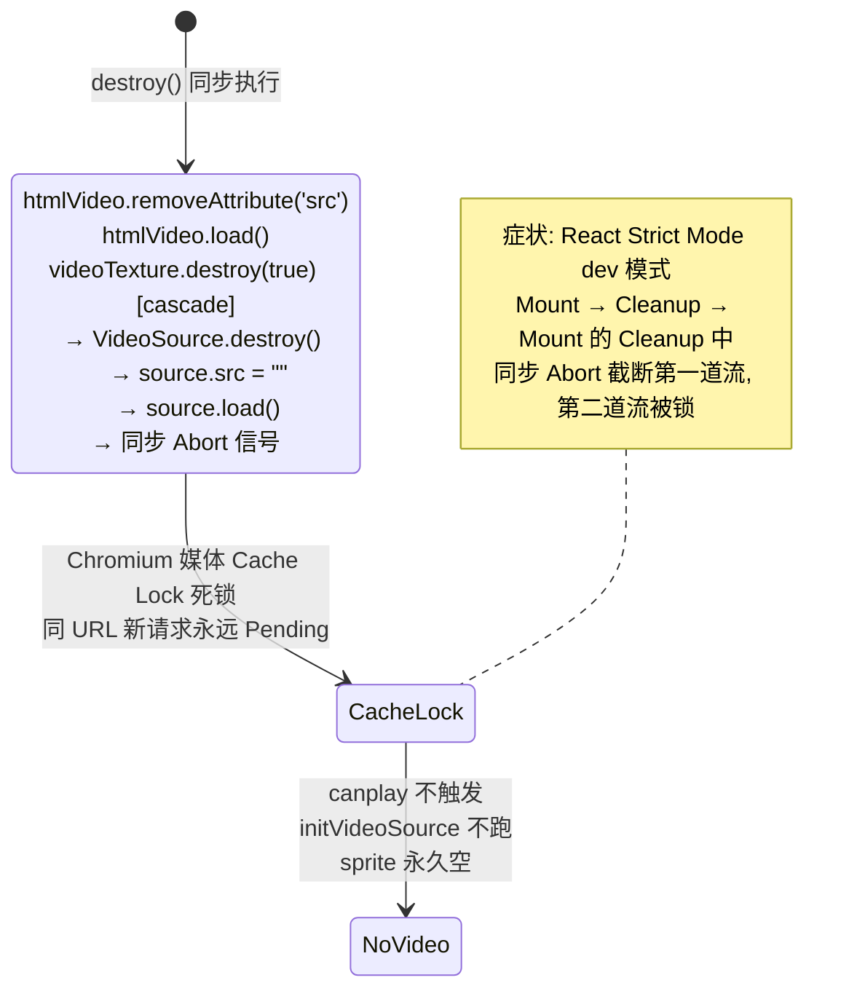

# ComponentVideoPlayerDisplay — 示例

`src/example/component-video-player/ComponentVideoPlayerDisplay.tsx` 的对应文档。

---

## 职责

演示 `createVideoPlayer` 在真实使用场景下的完整集成：
- 全屏 SubCanvas 装视频
- 右侧 HUD SubCanvas 装调试日志（`Scrollable` + `PIXI.Text`，每条 `onDebug` 入栈）
- 底部按钮 SubCanvas 装外部控制（Play/Pause 切换、Restart seek(0)）
- 销毁顺序：`player.destroy()` → `scrollable.destroy()` → 各 SubCanvas `.destroy()` → `destroyApp()`

URL 写死 `https://interactive-examples.mdn.mozilla.net/media/cc0-videos/friday.mp4`（MDN 公共测试视频，CC0）。

---

## 状态图

### React 组件生命周期（React 19 + Strict Mode dev）

### OLD 异步清理的延迟触发（关键竞态）

### 失败的 Abort 路径（已废弃，不要用）

---

## 状态变量与不变量

**useEffect 闭包内 `let`：**
- `root: SubCanvas | null` — 全屏 SubCanvas
- `hudRegion: SubCanvas | null` — 右侧 HUD
- `btnRegion: SubCanvas | null` — 底部按钮
- `scrollableLog: Scrollable | null` — HUD 内日志滚动区
- `player: PixiVideoPlayerHandle | null` — 视频播放器句柄
- `logTexts: PIXI.Text[]` — 日志 Text 对象数组（限制 LOG_MAX=100 条）

**销毁顺序不变量**（cleanup 体内）：
1. `player?.destroy()` 必须**最先**（PIXI 视频有 setTimeout 异步清理，释放得越早 GC 压力越小）
2. `scrollableLog?.destroy()`
3. `btnRegion?.destroy()` / `hudRegion?.destroy()` / `root` 置 null（这三个 region 是 SubCanvas，会随 `destroyApp()` 一起被销毁，但显式置 null 让 GC 早一步回收）
4. `destroyApp()` 必须**最后**（销毁 PixiApplication 自身 + 全局 ticker 清理）

**Strict Mode 兼容性**：
- useEffect deps `[]` — 整个生命周期只跑一轮
- Strict Mode dev 会跑 `Mount → Cleanup → Mount` 合成循环一次
- 合成 Cleanup 调 `player.destroy()` 是无害的（destroyed 守卫 + setTimeout 异步）
- 合成 Cleanup 调 `destroyApp()` 是无害的（PixiApp.destroy 幂等）

---

## 调试方法

HUD 实时显示 `onDebug` 消息。关键观察点：
- `primed first frame` — 首帧 primer 成功，纹理应有内容
- `loadedmetadata duration=X` — 元数据加载完，`adjustSpriteScale` 跑过
- `autoplay blocked by browser policy; UI stays paused, await user click` — autoplay 被拒，正常
- `Native video error code: X` — 原生 error，进入 fallback 或最终失败
- `Attempting Blob fetch fallback...` — CORS / Range 失败，走 blob 兜底
- `Fallback failed: ...` — 兜底也失败，显示红色 "Load failed"

**如果 sprite 一直是空的**（HUD 没有任何新消息）：
1. 检查 `loadedmetadata` 有没有出现 → 没出现 = `canplay` 都没触发 = 网络层问题
2. 看浏览器 DevTools Network 标签：htmlVideo 请求是不是 Pending 状态 → 是 = Cache Lock（v3 修法应该解决）
3. 看 Console 有没有 `Cannot read properties of null` → texture/source lifecycle bug
